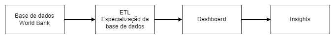
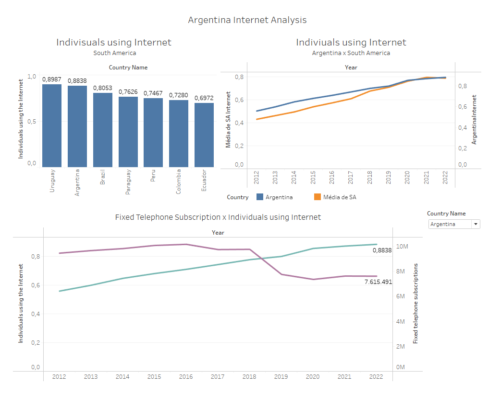

# Challenge Analytics

Projeto desenvolvido para a primeira parte do desafio do Mercado Livre.

## Processo de Análise de Dados

Este diagrama representa um processo de análise de dados usando uma base de dados proveniente do World Bank. A seguir, detalho cada etapa do processo conforme mostrado no diagrama:

### 1. Base de Dados World Bank
- Esta etapa inicial envolve a obtenção de dados brutos fornecidos pelo World Bank. Esses dados incluem uma ampla gama de indicadores econômicos e sociais, como PIB, taxa de desemprego, usuários de internet, entre outros.

### 2. ETL e Especialização da Base de Dados
- Nesta fase, os dados brutos passam por um processo de **ETL (Extract, Transform, Load)**. Isso inclui a extração dos dados relevantes, transformação para adequação ao formato necessário e gera;cão de um arquivo excel unificado.

### 3. Dashboard
- Uma vez que os dados estão prontos e organizados, são visualizados em um **dashboard**. 

### 4. Insights
- A partir das visualizações apresentadas no dashboard, é possível extrair insights e identificar padrões observados nos dados. Como por exemplo:
-- O aumento de usuários na internet é acompanhada da diminuição da assinatura de telefonia fixa;
-- A Argentina apresenta, históricamente, uma porcentagem de usuários de internet maior que a média da America do Sul;
-- Apenas o Uruguai possui mais usuários de internet do que a Argentina.
